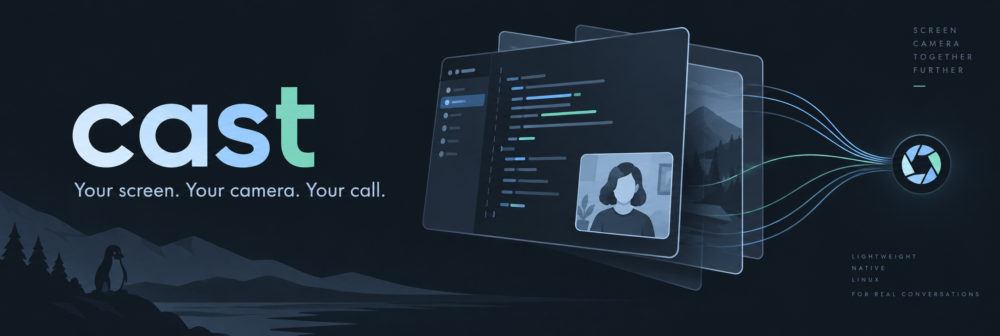
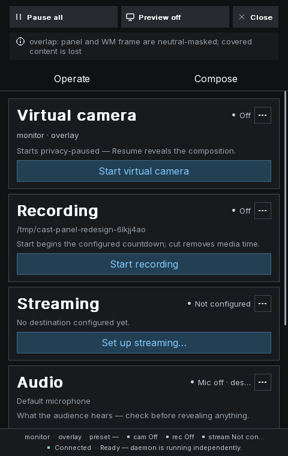

# cast



Your screen, your camera, your call. `cast` is a foreground Linux utility written in C
that composes screen capture and a webcam into an existing virtual camera, with optional
presentation annotations, PipeWire audio, independent local recording and RTMP/RTMPS
streaming. Runtime configuration and one CLI replace a scene editor or heavyweight GUI.

Xorg is the primary backend. Optional Wayland capture uses the ScreenCast portal and
PipeWire; selection, input and preview capabilities differ by backend. A conference
receives the composition as a webcam. Each participant can use their own camera tile;
cast does not change call layouts, resolution limits or compression. Text readability
depends on the conferencing app and viewers enlarging/pinning the tile.

## Install on Arch Linux

The release package includes Xorg, Wayland and the native control panel. On an
up-to-date Arch x86_64 system with curl installed:

```sh
curl -fsSL --proto '=https' --proto-redir '=https' \
  https://raw.githubusercontent.com/mattmezza/cast/v0.7/packaging/install.sh | sh -s -- v0.7
cast setup
```

The installer downloads the release package, verifies its SHA-256 checksum and
uses pacman to install it with dependencies. sudo is needed for installation.
For an inspectable download, save the script first and read it before running it.
If an earlier `make install` placed cast in `/usr/local/bin`, remove that manual
installation with `sudo make uninstall PREFIX=/usr/local` from its source checkout,
or use `/usr/bin/cast` explicitly; the older executable can take priority in PATH.
Virtual-camera setup is a separate step explained by `cast setup`; the installer
does not create devices or change your configuration.

```sh
cast update v0.7
cast completions
```

`cast update` without a version selects the latest release. Stop your running cast
daemon before updating, then restart it. Other distributions can build from source.

## Project status

cast is open source under the MIT license. This is a personal project; contributions
and pull requests are not currently accepted. Issues may be used to report bugs,
with no response-time commitment.

## Build and run

Build dependencies: C compiler, GNU make, pkg-config, FFmpeg development libraries
(libavcodec/libavformat/libavutil/libswscale/libswresample), PipeWire, Fontconfig,
FreeType and a system font (default Noto Sans), and for Xorg
Xlib/Xext/XRandR/XInput2/XFixes/XComposite. Vendored inih requires no separate installation.
Wayland adds GLib GDBus (`gio-unix-2.0`). Software libx264/AAC encoding is the default.

```sh
make -j
./cast --version
./cast config check examples/cast.conf
./cast doctor
```

`make X11=1 WAYLAND=1` enables both backends. `make X11=0 WAYLAND=1` removes Cast’s direct Xorg build dependencies. `make check`, `make sanitize` and `make package` run verification,
sanitizers and binary/source packaging respectively. `make check-unit` runs independent
tests without needing socket bind/display permissions; `make check-xorg` runs the
isolated Xvfb smoke, and `make benchmark` measures composition alone. Test dependencies (Python, Xvfb,
optional XTest and FFmpeg tools for inspection) are not normal runtime dependencies.
`make check-loopback LOOPBACK_DEVICE=/dev/video10` additionally tests synthetic
output and recording through an existing loopback device; select the intended device explicitly.

An optional native control panel uses Clay, SDL3 and SDL3_ttf. On Arch, install
them with `sudo pacman -S --needed sdl3 sdl3_ttf`, build with
`make X11=1 WAYLAND=1 PANEL=1`, and launch
`./cast panel` alongside the daemon. Closing the panel leaves capture running.
See [panel controls and capture visibility](docs/control-panel.md).



*Private synthetic fixture; capture capabilities depend on the selected backend.*

Before virtual camera output, create an existing loopback device. These commands are for an
Arch user running the `linux` kernel to execute; cast does not run them:

```sh
sudo pacman -S --needed base-devel pkgconf ffmpeg pipewire fontconfig freetype2 noto-fonts libx11 libxext libxrandr libxi libxfixes libxcomposite
sudo pacman -S --needed v4l2loopback-dkms linux-headers v4l-utils
sudo modprobe v4l2loopback devices=1 video_nr=10 card_label=cast exclusive_caps=1
```

Use matching headers for your kernel, such as linux-lts-headers for linux-lts. The
[Arch package](https://archlinux.org/packages/extra/any/v4l2loopback-dkms/) provides DKMS
sources. See [setup and troubleshooting](docs/troubleshooting.md) for kernel updates,
permissions and portal installation. No privileged setup has been executed by this build.

Edit a copy of [examples/cast.conf](examples/cast.conf) for your actual devices:

```sh
mkdir -p ~/.config/cast
# Copy only when creating your configuration; keep existing edits.
cp -n examples/cast.conf ~/.config/cast/cast.conf
./cast
```

The panel and preview are Xorg utility windows (`CastPanel` and `CastPreview`);
window managers that float utilities, including mwm, center them automatically.
The panel follows the supplied **Operate / Compose** design. Its slim header
contains global privacy, Preview and Close. Operate has four always-expanded task
cards with direct output actions and an Audio card. Compose has six dedicated pages,
with Essentials first and **All settings** revealing the rest. Sticky Back and a
pinned Apply/Revert bar stay accessible while scrolling. Alt+1…6 jump directly
to sections, 1/2 switch tabs, and Escape goes back. Drafts stay local until Apply
or Enter; camera and stage size sliders update the composition on release. Page
and scroll restore when reopening the panel in the same session. Preview remains a separate floating window with three target
pills. A recording countdown temporarily uses it and hides it before recording
begins.

The virtual camera starts with a neutral **Paused** frame at normal cadence. In another
terminal, explicitly enable virtual video and then select `cast` in the conference:

```sh
./cast virtual resume
./cast layout next
./cast pause
./cast resume
./cast record start
./cast record pause                 # write a solid title/subtitle/footer screen
./cast record resume
./cast record cut                   # omit this interval from the file
./cast record resume                # same file, with the configured countdown
./cast record stop
./cast quit
```

The daemon runs in the terminal and opens no window by default. Use `./cast preview on`
for a local view of the actual output. The physical camera LED can turn on during
startup privacy pause: cast opens the input device, while transmitted video stays
neutral until explicit virtual camera resume.

The `stage` layout places an inset screen opposite the camera anchor. Resize either
source while keeping its aspect ratio; they overlap when their sizes need it. Screen
borders and rounded corners are configurable. Compose → Background & stage includes screen
appearance and a shared background with blurred screen/camera, solid fill, or a
custom two/three-color gradient. Effects includes transparent logo and static text
placement, with independent edge distances and font selection.

```sh
cast layout stage
cast screen size 78%
cast screen radius 24
cast screen border width 2
cast screen border color '#ffffff'
cast camera anchor bottom-right
cast layout prev                     # every next cycle also accepts prev
cast logo path /absolute/path/logo.png
cast logo on
cast text set 'Matteo · Demo'
cast text font 'Noto Sans'
cast text on
```

Streaming sends the same composition and selected audio to one RTMP/RTMPS service,
independently of recording and conferencing. Configure the server address and a
mode-600 **stream-key file**, then use the explicit two-step start:

```sh
cast stream start           # connects privacy-paused
cast stream status --json
cast stream resume          # deliberately reveal the composition
cast stream pause           # pause screen + silence, continuous connection
cast stream stop
```

See [Twitch/YouTube setup and local streaming limits](docs/streaming.md).
`cast --no-virtual` supports streaming/recording without a loopback device.

**Migration from v0.6:** `cast live` is now `cast virtual`, `--no-live` is
`--no-virtual`, `preview target live` becomes `preview target virtual`, and
`annotations.live_keys/live_clicks` become `annotations.virtual_keys/virtual_clicks`.
Status JSON has `virtual` and `stream` objects. Old spellings fail with migration
instructions; there are no aliases.

Camera content is mirrored by default; the screen stays unmirrored. Use
`./cast camera mirror off` to disable it for the session, or set `mirror = false`
in the configuration's `[camera]` section.

`./cast virtual message "Back in five minutes"` changes the solid pause title for
this session. **Compose → Pause & blur screens** edits optional titles,
subtitles, footers, text spacing, colours and blur strength. **Operate** provides
independent output controls and recording cut/resume. Successful start/resume actions
select that output’s preview target; a later manual choice takes precedence.

```sh
cast camera anchor top             # middle of the top edge; also bottom/left/right
cast virtual freeze
cast virtual blur on                  # blur the frozen frame; unfreeze keeps blur on
cast virtual pause                    # solid screen overrides freeze and blur
cast settings output.pause_title "Back soon" output.pause_subtitle "{date:%A} {time:%H:%M}"
```

Persistent styles live in `[output]`: `pause_title`, `pause_subtitle`, `pause_footer`,
`pause_text_gap` (title/subtitle distance in pixels), `pause_background`,
`pause_foreground`, and the corresponding `blur_*` settings.
Choose `pause_font` / `blur_font` only in the config file, then `cast config reload`.
Noto Sans is the default. All three text fields may be empty. [Date/time placeholders
and custom formats](docs/configuration.md#pause-and-blur-text) update while displayed.
Existing `pause_text` and `pause_color` configurations remain supported.

With exclusive_caps=1, some consumers detect the camera only after the producer starts.
Virtual audio is a separate optional device. cast cannot mute a physical mic selected
directly by the call app; use the app's mute control or select cast's virtual microphone.
Desktop audio is off by default and requires explicit source selection. All-key overlays
are off by default and can expose sensitive typing. Recent keystrokes stay visible
for three seconds by default, with consecutive repeats grouped as `j`, `jx2`,
`jx3`; use `cast settings keys.timeout_ms 4000` for a four-second history. Freeze deliberately holds content;
use solid pause for privacy. Blur is a presentation effect and can leave content
recognizable. Recording pause now writes a solid screen with silence; **cut** removes
interruption time from the same file. Pause, freeze and blur silence cast audio.

For recording without a virtual camera, use `./cast --no-virtual`; for screen-only use
`./cast --no-camera` and `./cast layout screen`. Device paths and output dimensions can
also be passed at startup. Configuration precedence is defaults, file, startup flags,
then session commands; commands never write configuration back to disk.

## Reference and verification

- [Complete CLI reference](docs/cli.md), [man page](docs/cast.1), and `cast COMMAND --help`.
- [Configuration schema and reload rules](docs/configuration.md).
- [Architecture and state machines](docs/architecture.md), [media details](docs/media.md),
  and [Xorg/composition behavior](docs/visual.md).
- [Wayland capability matrix](docs/wayland.md) and [hardware acceptance checklist](docs/hardware-acceptance.md).
- [Verification results](docs/verification.md) and [requirements traceability](docs/requirements.md).
- [sxhkd bindings](examples/sxhkdrc) and [Arch PKGBUILD](packaging/PKGBUILD).
- [AUR packaging and first submission](docs/aur.md).

Installation uses `make install PREFIX=/usr/local`; `DESTDIR` supports staging.
`make uninstall` removes installed project files. The example is installed under
share/doc/cast and never overwrites a user's configuration. `make package` creates a
ready-to-run dynamically linked Linux archive in dist, its runtime library manifest,
and matching project source. The binary targets the build machine's ABI; install its
listed runtime dependencies. [Release instructions](docs/releases.md) cover
`make release-check` and `make release RELEASE_NOTES=path/to/notes.md`, which build
from a clean, pushed version tag and attach binary, project/dependency source archives and checksums to
a GitHub release through `gh`.

Project source is [MIT licensed](LICENSE); the original bundled bitmap font shares that
license. inih is BSD-3-Clause. FFmpeg licensing depends on its build; this machine uses
GPL-enabled FFmpeg, so binary redistribution must meet the applicable GPL obligations.
See [dependency and license rationale](docs/dependencies.md) and packaged notices.
